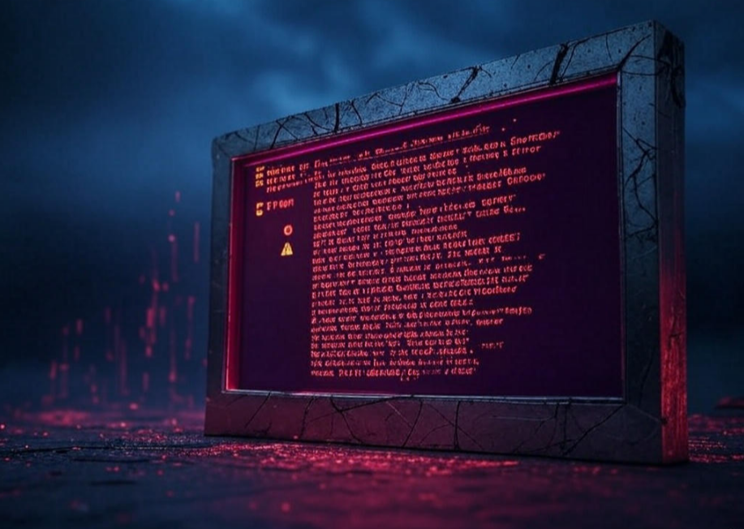

# 🚀 Ultimate Development Environment Hub

<p align="center">
    <a href="https://github.com/MoElsherbiny/Development-Environment-Setup-Scripts/releases">
        
    </a>
    <a href="https://github.com/MoElsherbiny/Development-Environment-Setup-Scripts/commits">
        
    </a>
    <a href="LICENSE">
        
    </a>
    <a href="https://github.com/MoElsherbiny/Development-Environment-Setup-Scripts/stargazers">
        
    </a>
</p>
<p align="center">
    Welcome, brave developer, to the <b>Ultimate Development Environment Hub</b>—your gateway to turbo-charged productivity with Unreal Engine and web development! Created by <b>Mohamed Elsherbiny</b>.
</p>
<p align="center">
    This repository houses two powerhouse scripts: <code>UnrealSetup</code> and <code>WebDeveloperSetup</code>. Together, they transform your machine into a futuristic playground for gaming, 3D artistry, and web innovation as of <b>March 16, 2025</b>. ✨
</p>

<hr>

## 🌌 Mission: Launch Your Creative Universe

<table width="100%">
    <tr>
        <td width="60%" valign="top">
            <p>Imagine a world where your development environment is as seamless as a sci-fi holodeck—tools installed, configurations optimized, and workflows streamlined with a single command. That’s what this repo delivers!</p>
            <p>Whether you’re crafting breathtaking Unreal Engine worlds or building cutting-edge web applications, these scripts are your AI-powered copilots.</p>
        </td>
        <td width="40%" align="right">
            
        </td>
    </tr>
</table>

## 📋 Table of Contents

- [🚀 Ultimate Development Environment Hub](#-ultimate-development-environment-hub)
  - [🌌 Mission: Launch Your Creative Universe](#-mission-launch-your-creative-universe)
  - [📋 Table of Contents](#-table-of-contents)
  - [🌟 What’s Inside?](#-whats-inside)
  - [⚡ Features](#-features)
    - [Key Features](#key-features)
  - [🚀 Getting Started](#-getting-started)
    - [UnrealSetup](#unrealsetup)
    - [WebDeveloperSetup](#webdevelopersetup)
  - [📋 Requirements](#-requirements)
    - [System Requirements](#system-requirements)
  - [🛠️ Installation](#️-installation)
    - [Detailed Installation Steps](#detailed-installation-steps)
  - [🎨 Customization](#-customization)
    - [UnrealSetup](#unrealsetup-1)
    - [WebDeveloperSetup](#webdevelopersetup-1)
  - [🛠️ Troubleshooting](#️-troubleshooting)
    - [Common Issues](#common-issues)
    - [Detailed Troubleshooting](#detailed-troubleshooting)
  - [🤝 Contributing](#-contributing)
    - [Contribution Guidelines](#contribution-guidelines)
  - [📜 License](#-license)
  - [🌠 The Future is Now](#-the-future-is-now)
  - [Granting PowerShell Full Control via Registry Editor](#granting-powershell-full-control-via-registry-editor)
    - [When Needed](#when-needed)
    - [Steps](#steps)
    - [Verification](#verification)
    - [Reverting Changes](#reverting-changes)

<hr>

## 🌟 What’s Inside?

<p>This repository is your launchpad for two distinct yet complementary development environments:</p>

<table width="100%">
    <tr>
        <td width="60%" valign="top">
            <h3>🎮 UnrealSetup</h3>
            <ul>
                <li><b>Purpose</b>: Set up an optimized environment for Unreal Engine (versions 4.27–5.4) development.</li>
                <li><b>Tools</b>: Chocolatey, Visual Studio, Epic Games Launcher, Git, Blender, Substance Painter, and more.</li>
                <li><b>Highlights</b>: Multi-version support, artist/developer tools, PowerShell enhancements, and parallel installations.</li>
                <li><b>Ideal For</b>: Game developers, 3D artists, and teams standardizing Unreal Engine setups.</li>
            </ul>
        </td>
        <td width="40%" align="right">
            
        </td>
    </tr>
</table>

<table width="100%">
    <tr>
        <td width="60%" valign="top">
            <h3>🌐 WebDeveloperSetup</h3>
            <ul>
                <li><b>Purpose</b>: Configure a robust Windows environment for web development and DevOps.</li>
                <li><b>Tools</b>: Scoop, winget, Git, Node.js, Python, Docker, VS Code, Kubernetes, and cloud CLIs.</li>
                <li><b>Highlights</b>: Automated PATH management, scheduled updates, VS Code integration, and terminal customization.</li>
                 <li><b>Ideal For</b>: Web developers, DevOps engineers, and cloud computing enthusiasts.</li>
            </ul>
        </td>
        <td width="40%" align="right">
            
        </td>
    </tr>
</table>

<hr>

## ⚡ Features

### Key Features

<table width="100%">
    <tr>
        <td width="60%" valign="top">
            <p><b>- Automation Magic</b>: Installs hundreds of tools with a single command—see it in this screenshot:</p>
        </td>
        <td width="40%" align="right">
            
        </td>
    </tr>
</table>

<table width="100%">
    <tr>
        <td width="60%" valign="top">
            <p><b>- Cross-Tool Harmony</b>: Integrates version control, IDEs, languages, and utilities seamlessly.</p>
            <p><b>- Customizable Workflows</b>: Tailor installations via interactive prompts—view a sample prompt:</p>
        </td>
        <td width="40%" align="right">
            
        </td>
    </tr>
</table>

<table width="100%">
    <tr>
        <td width="60%" valign="top">
            <p><b>- Backup & Restore</b>: Safeguards your environment with backups before changes.</p>
            <p><b>- Future-Proof</b>: Updated continuously to match the latest tools as of February 2025.</p>
        </td>
        <td width="40%" align="right">
            
        </td>
    </tr>
</table>

<hr>

## 🚀 Getting Started

### UnrealSetup

1. **Clone or Download**:

   - Navigate to the `UnrealSetup` folder:
     ```bash
     git clone <repository-url>
     cd UnrealSetup
     ```

2. **Run as Admin**:

   - Open PowerShell as Administrator:
     ```powershell
     .\UnrealEngineSetup.ps1
     ```

3. **Follow the Cosmic Prompts**:
   - Customize your setup (e.g., UE versions, tools) or accept defaults.

**Pro Tip**: Use `Restore-Environment` to revert changes if needed. Check the [UnrealSetup ReadMe](UnrealSetup/ReadMe.md) for detailed usage.

---

### WebDeveloperSetup

1. **Clone or Download**:

   - Navigate to the `WebDeveloperSetup` folder:
     ```bash
     git clone <repository-url>
     cd WebDeveloperSetup
     ```

2. **Run as Admin**:

   - Open PowerShell as Administrator:
     ```powershell
     .\WindowsDevEnv-Setup.ps1
     ```

3. **Customize Your Galaxy**:
   - Confirm optional tool installations (e.g., browsers).

**Pro Tip**: Run `Update-DevEnv` weekly for automatic updates! Check the [WebDeveloperSetup ReadMe](WebDeveloperSetup/ReadMe.md) for advanced configurations.

---

## 📋 Requirements

### System Requirements

| Platform                    | OS                 | Privileges    | Tools Required              | Disk Space (Minimum)      | Disk Space (Recommended)          |
| --------------------------- | ------------------ | ------------- | --------------------------- | ------------------------- | --------------------------------- |
| **Windows (General)**       | Windows 10/11      | Administrator | PowerShell 5.1+, Scoop      | ~22 GB                    | **~30-35 GB**                     |
| **macOS (General)**         | macOS 10.15+       | Admin         | Homebrew                    | ~15-20 GB                 | **~20-25 GB**                     |
| **Linux (General)**         | Ubuntu/Fedora/RHEL | sudo          | apt/dnf                     | ~13-17 GB                 | **~20-25 GB**                     |
| **Windows (Unreal Engine)** | Windows 10/11      | Administrator | PowerShell 5.1+, Chocolatey | ~90-100 GB (1 UE version) | **~145-225 GB** (2-3 UE versions) |

<table width="100%">
    <tr>
        <td width="60%" valign="top">
            <p><b>- Internet Connection</b>: Essential for downloading packages.</p>
            <p><b>- Patience</b>: Let the scripts work their magic—complex setups take time!</p>
        </td>
        <td width="40%" align="right">
            
        </td>
    </tr>
</table>

<hr>

## 🛠️ Installation

### Detailed Installation Steps

<table width="100%">
    <tr>
        <td width="60%" valign="top">
            <p>Follow the steps under [Getting Started](#getting-started) for your chosen setup. Both scripts require:</p>
            <ul>
                <li>Administrator/sudo privileges.</li>
                <li>A stable internet connection.</li>
                <li>PowerShell (Windows) or Bash/Zsh (macOS/Linux).</li>
            </ul>
            <p><b>Surprise Bonus</b>: If you’re on macOS or Linux, imagine a script that uses Homebrew or apt/dnf to mirror these setups—contact me to co-create it! 🌍</p>
        </td>
        <td width="40%" align="right">
            
        </td>
    </tr>
</table>

<hr>

## 🎨 Customization

### UnrealSetup

<table width="100%">
    <tr>
        <td width="60%" valign="top">
            <ul>
                <li>Edit <code>$defaultConfig</code> in <code>UnrealEngineSetup.ps1</code> to disable features (e.g., <code>InstallArtistTools = $false</code>).</li>
                <li>Add custom PowerShell aliases in the profile—see an example:</li>
                 <li>Customize Visual Studio workloads and components for Unreal Engine development.</li>
            </ul>
        </td>
        <td width="40%" align="right">
            
        </td>
    </tr>
</table>

### WebDeveloperSetup

<table width="100%">
    <tr>
        <td width="60%" valign="top">
            <ul>
                <li>Modify <code>$scoopApps</code> or <code>$essentialExtensions</code> to include/exclude tools.</li>
                <li>Tweak <code>$envVars</code> for custom environment variables—view a sample configuration:</li>
                <li>Configure Windows Terminal profiles and default settings.</li>
            </ul>
        </td>
        <td width="40%" align="right">
            
        </td>
    </tr>
</table>

<table width="100%">
    <tr>
        <td width="60%" valign="top">
            <p><b>Creative Twist</b>: Add your favorite tools by forking this repo and submitting a PR—let’s build a universe together!</p>
        </td>
        <td width="40%" align="right">
            
        </td>
    </tr>
</table>

<hr>

## 🛠️ Troubleshooting

### Common Issues

<table width="100%">
    <tr>
        <td width="60%" valign="top">
            <p><b>- Script Fails to Run</b>:</p>
            <ul>
                <li>Ensure Administrator privileges and <code>Set-ExecutionPolicy -Scope CurrentUser -ExecutionPolicy Bypass -Force</code>.</li>
                <li>See this troubleshooting image:</li>
            </ul>
        </td>
        <td width="40%" align="right">
            
        </td>
    </tr>
</table>

<table width="100%">
    <tr>
        <td width="60%" valign="top">
            <p><b>- Internet or Package Issues</b>:</p>
            <ul>
                <li>Verify connectivity; retry with <code>scoop update</code> or <code>winget upgrade --all</code>.</li>
            </ul>
            <p><b>- Tool Missing</b>:</p>
            <ul>
                <li>Check logs (<code>%TEMP%\dev-setup-*.log</code> or <code>~/UnrealSetupBackup/*.log</code>)—view a log example:</li>
            </ul>
        </td>
        <td width="40%" align="right">
            
        </td>
    </tr>
</table>

<p><b>Surprise Fix</b>: Use the [Granting PowerShell Full Control](#granting-powershell-full-control-via-registry-editor) section for Windows-specific permission woes.</p>

### Detailed Troubleshooting

<p>For more in-depth troubleshooting, refer to the individual README files:</p>
<ul>
    <li><a href="UnrealSetup/ReadMe.md">UnrealSetup Troubleshooting</a></li>
    <li><a href="WebDeveloperSetup/ReadMe.md">WebDeveloperSetup Troubleshooting</a></li>
</ul>

<hr>

## 🤝 Contributing

Join the cosmic dev community! Here’s how:

1. Fork this repo.
2. Create a branch: `git checkout -b feature/unreal-web-sync`.
3. Commit your magic: `git commit -m "Sync Unreal and Web setups with AI insights"`.
4. Push to the stars: `git push origin feature/unreal-web-sync`.
5. Open a PR—let’s explore the galaxy together!

<table width="100%">
    <tr>
        <td width="60%" valign="top">
        </td>
        <td width="40%" align="right">
            
        </td>
    </tr>
</table>

### Contribution Guidelines

<p>Please follow these guidelines when contributing:</p>
<ul>
    <li>Ensure your code adheres to PowerShell best practices.</li>
    <li>Include detailed comments and documentation.</li>
    <li>Test your changes thoroughly before submitting a pull request.</li>
</ul>

<hr>

## 📜 License

Licensed under the MIT License by **Mohamed Elsherbiny**. See [LICENSE](LICENSE) for details.
**Copyright © 2025 Mohamed Elsherbiny**

<hr>

## 🌠 The Future is Now

<table width="100%">
    <tr>
        <td width="60%" valign="top">
            <p>This repo isn’t just code—it’s a portal to your next big project. Whether you’re rendering Unreal worlds or coding web apps, these setups are your launchpad to infinity. Stay tuned 🚀</p>
        </td>
        <td width="40%" align="right">
            
        </td>
    </tr>
</table>

<table width="100%">
    <tr>
        <td width="60%" valign="top">
            <p><b>Surprise Ending</b>: Imagine this repo evolving with AI-driven auto-optimization—stay connected for exciting announcements! 🌌</p>
        </td>
        <td width="40%" align="right">
            
        </td>
    </tr>
</table>

<hr>

## Granting PowerShell Full Control via Registry Editor

### When Needed

- Required if execution policies remain restrictive despite `Set-ExecutionPolicy`.
- Useful in locked-down environments (e.g., corporate systems).

### Steps

1. **Open Registry Editor**:
   - `Win + R` → `regedit` → Yes (UAC prompt).
2. **Navigate to PowerShell Key**:
   - `HKEY_LOCAL_MACHINE\SOFTWARE\Policies\Microsoft\Windows\PowerShell`
   - If missing, right-click `Windows` → New → Key → Name it `PowerShell`.
3. **Enable Scripts**:
   - Right-click `PowerShell` → New → DWORD (32-bit) Value → Name: `EnableScripts` → Value: `1`.
4. **Grant Permissions**:
   - Navigate: `HKEY_LOCAL_MACHINE\SYSTEM\CurrentControlSet\Control\Session Manager\Environment`
   - Right-click `Environment` → Permissions → Add → `SYSTEM` → Full Control → Apply.
5. **Restart**:
   - Reboot to apply changes.

### Verification

- Run: `Get-ExecutionPolicy -List`
- Expected: `MachinePolicy`/`UserPolicy` as `Unrestricted` or `RemoteSigned`.
- Test: `.\WindowsDevEnv-Setup.ps1`

### Reverting Changes

1. **Remove EnableScripts**:
   - Delete `EnableScripts` from `HKEY_LOCAL_MACHINE\SOFTWARE\Policies\Microsoft\Windows\PowerShell`.
2. **Reset Permissions**:
   - Remove `SYSTEM` Full Control from `Environment` key.
3. **Restore Policy**:
   - `Set-ExecutionPolicy Restricted -Scope LocalMachine -Force`
